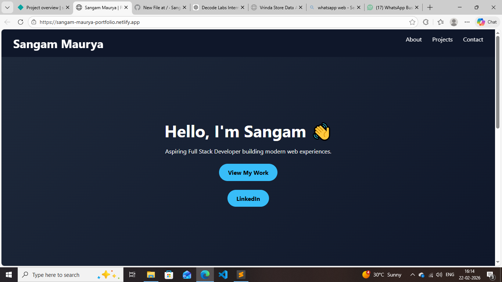

# 🚀 Sangam Maurya | Developer Portfolio

## 🌐 Live Website
🔗 **https://sangam-maurya-portfolio.netlify.app/**  

---

## 👨‍💻 About Me

I am an MCA student and aspiring Full Stack Developer with hands-on experience in both **Web Development** and **Data Analysis**.

I build responsive and interactive web applications using:

- HTML  
- CSS  
- JavaScript  

I also work with:

- Python  
- Excel  
- Data Visualization & Dashboard Creation  

I am passionate about combining technology and data to build impactful and user-friendly digital solutions.

---

## 🛠 Tech Stack

### 💻 Frontend
- HTML5  
- CSS3  
- JavaScript  

### 📊 Data & Analytics
- Python  
- Excel  
- Data Cleaning & Visualization  

---

## 📂 Featured Projects

### 🔹 Responsive Frontend Website  
A modern responsive UI project built using pure HTML, CSS, and JavaScript.

### 🔹 Excel Sales Analysis Dashboard  
Sales data analysis dashboard with insights and visualization built in Excel.

---

## 📞 Connect With Me

🔗 LinkedIn: https://www.linkedin.com/in/sangammaurya 
💻 GitHub: https://github.com/Sangam200414  

---

⭐ If you like my work, feel free to explore and connect!
